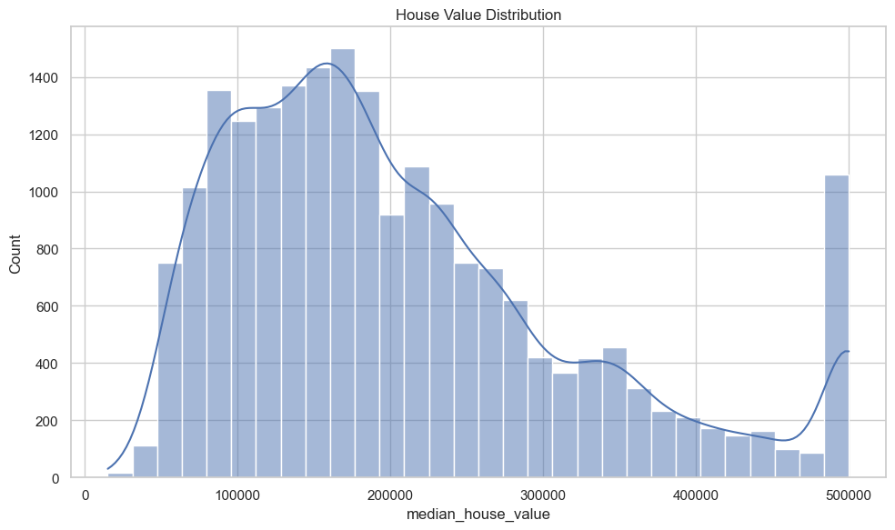
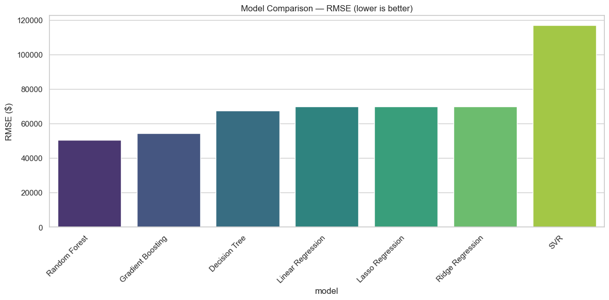
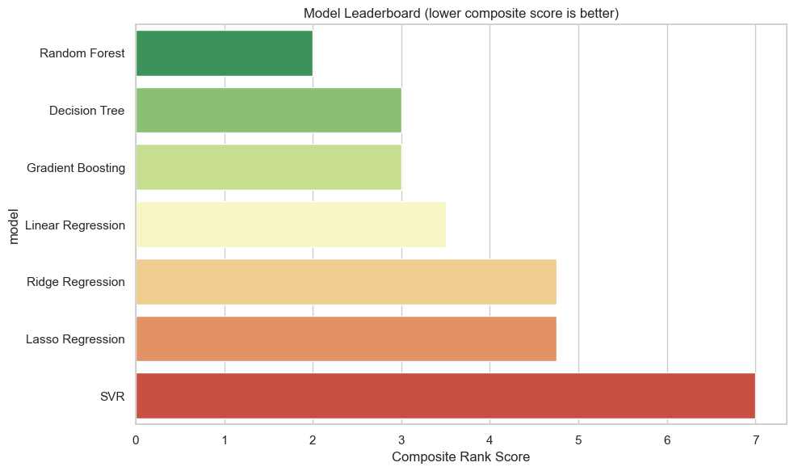
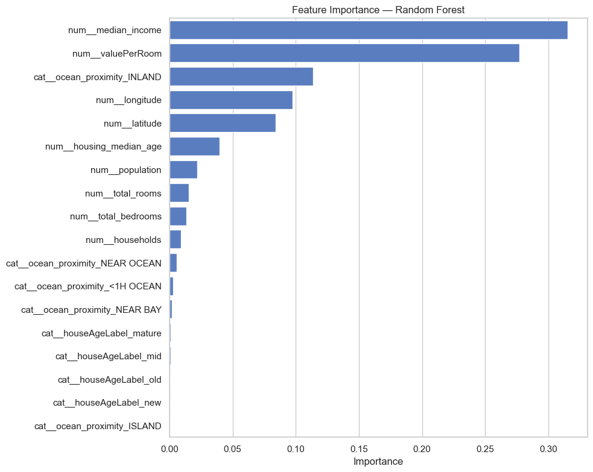
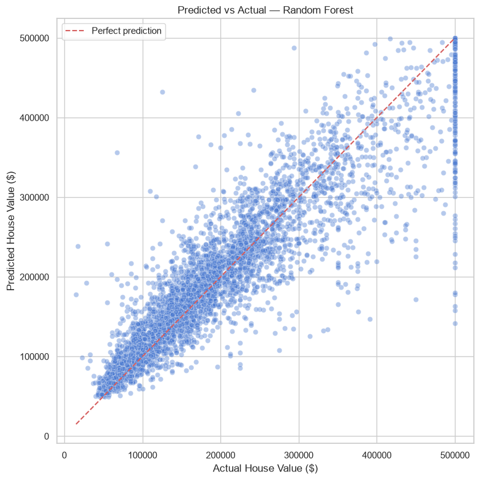

# California Housing Price Prediction

End-to-end ML project to predict median house values for California districts using 1990 census data.

## Problem Statement

Build a regression model that predicts `median_house_value` for a California block group. The pipeline handles missing data, engineers features (`houseAgeLabel`, `valuePerRoom`), compares 7 regression algorithms, and selects the best model using a composite score (not R² alone).

## Dataset Description

**California Housing Prices** — each row is one block group.

| Category | Features |
|----------|----------|
| Location | `longitude`, `latitude`, `ocean_proximity` |
| Housing | `housing_median_age`, `total_rooms`, `total_bedrooms` |
| Demographics | `population`, `households`, `median_income` |
| Target | `median_house_value` |

- **Rows:** 20,640
- **File:** `data/California Housing Prices.csv`

## Project Structure

```text
├── app/                      # Streamlit UI
│   └── app.py
├── data/                     # Raw dataset
├── models/                   # best_model.pkl, feature_info.json
├── notebooks/eda.ipynb       # Interactive EDA
├── outputs/
│   ├── figures/              # EDA and evaluation plots
│   ├── metrics/              # comparison.csv, cross_validation.json
│   └── reports/              # Markdown reports
├── src/
│   ├── utils.py              # Paths, loading, inspection reports
│   ├── preprocessing.py      # Cleaning, encoding, scaling
│   ├── feature_engineering.py
│   ├── train.py              # Train all 7 models
│   ├── evaluate.py           # Metrics, CV, model selection
│   ├── predict.py            # Load model and predict
│   └── visualization.py      # All plots
├── tests/                    # Unit tests
├── requirements.txt
└── README.md
```

## Installation

```bash
git clone git@github.com:EleniAndualem/IDAE-Sec-4-Group-2-Assignment.git
cd IDAE-Sec-4-Group-2-Assignment
python -m venv .venv
```

**Windows:**
```powershell
.\.venv\Scripts\Activate.ps1
pip install -r requirements.txt
```

**Linux/macOS:**
```bash
source .venv/bin/activate
pip install -r requirements.txt
```

## Usage Commands

Run from project root:

```bash
# Train all models
PYTHONPATH=. python -m src.train

# Full evaluation pipeline (train + metrics + save best model)
PYTHONPATH=. python -m src.evaluate

# Make a single prediction
PYTHONPATH=. python -m src.predict

# Run unit tests
PYTHONPATH=. pytest tests/ -v

# Launch Streamlit app
streamlit run app/app.py
```

## Model Comparison Results

Best model: **Random Forest** (composite score: RMSE + MAE + R² + training time).

| Rank | Model | RMSE | MAE | R² | Train (s) | Predict (s) |
|------|-------|------|-----|----|-----------|-------------|
| 1 | Random Forest | $50,476 | $32,960 | 0.8056 | 0.371 | 0.016 |
| 2 | Gradient Boosting | $54,410 | $37,051 | 0.7741 | 1.983 | 0.007 |
| 3 | Decision Tree | $67,437 | $42,981 | 0.6530 | 0.206 | 0.003 |
| 4 | Linear Regression | $69,944 | $50,498 | 0.6267 | 0.021 | 0.003 |
| 5 | Lasso Regression | $69,944 | $50,498 | 0.6267 | 0.209 | 0.003 |
| 6 | Ridge Regression | $69,951 | $50,504 | 0.6266 | 0.019 | 0.003 |
| 7 | SVR | $116,845 | $86,969 | -0.0419 | 5.558 | 2.166 |

Full report: `outputs/reports/model_comparison.md`

## Screenshots

**House value distribution (EDA):**



**Model RMSE comparison:**



**Model leaderboard:**



**Random Forest feature importance:**



**Predicted vs actual (Random Forest):**



**Streamlit app — run `streamlit run app/app.py` to interact with:**
- Home overview and key metrics
- Dataset explorer
- EDA figures
- Model comparison
- Live price prediction form
